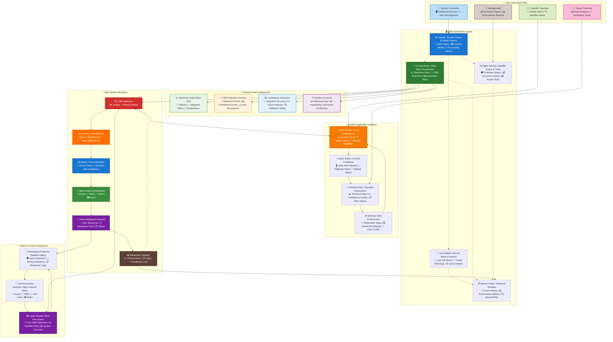

```mermaid
graph TB
    %% Main Dashboard Layout with proper positioning
    subgraph "🖥️ Main Dashboard Layout"
        A["📊 Header: System Status & Health Metrics<br/>🔴 CME Status | 🟢 System Health | ⚡ Processing Speed"]
        B["🔔 Left Sidebar: Recent Alerts & Actions<br/>📅 Last 24h Alerts | 🚨 Active Warnings | ⚙️ Quick Actions"]
        C["🌊 Central Panel: Solar Wind Visualization<br/>📈 Real-time Data | 🎯 CME Detection | 📊 Parameter Plots"]
        D["🛰️ Right Sidebar: Satellite Status & Tools<br/>🛡️ Protection Status | 💰 Economic Impact | 📤 Export Tools"]
        E["📋 Bottom Panel: Historical Timeline<br/>📜 Event History | 📊 Performance Metrics | 🔍 Search/Filter"]
        
        A -.-> B
        A -.-> C
        A -.-> D
        B -.-> E
        C -.-> E
        D -.-> E
    end
    
    %% Mobile Application Interface with navigation flow
    subgraph "📱 Mobile Application Interface"
        F["🚨 Alert Screen: Push Notifications<br/>⚠️ Severity Level | ⏰ Impact Time | 🎯 Affected Satellites"]
        G["⚡ Quick Status: Current Conditions<br/>🌡️ Solar Wind Speed | 🧲 Magnetic Field | 📡 System Status"]
        H["🔬 Detailed View: Scientific Parameters<br/>📊 Technical Data | 📈 Confidence Levels | 📋 Raw Values"]
        I["⚙️ Settings: Alert Preferences<br/>🔔 Notification Types | 🎚️ Threshold Settings | 👤 User Profile"]
        
        F --> G
        G --> H
        H --> I
        I --> F
    end
    
    %% Mission Control Integration with operational flow
    subgraph "🏢 Mission Control Integration"
        J["📺 Large Display: Real-time Status<br/>🎯 Live CME Detection | 🛰️ Satellite Fleet | 📊 System Overview"]
        K["🤖 Automated Protocols: Satellite Safing<br/>🛡️ Auto-Protection | 🔄 Backup Systems | 📋 Response Logs"]
        L["📡 Communication Interface: Multi-channel Alerts<br/>📧 Email | 📱 SMS | 🔔 API Calls | 📻 Radio"]
        
        J --> K
        K --> L
        L --> J
    end
    
    %% Central Panel Details with enhanced components
    subgraph "🎯 Central Panel Components"
        C1["📈 Real-time Solar Wind Plot<br/>🌊 Velocity | 🧲 Magnetic Field | 🔥 Temperature"]
        C2["🚨 CME Detection Overlay<br/>🎯 Detection Points | 📊 Confidence Zones | ⚠️ Alert Boundaries"]
        C3["📊 Confidence Indicators<br/>🎯 Detection Accuracy | 📈 Trend Analysis | 🔍 Validation Status"]
        C4["⏰ Timeline Controls<br/>⏮️ Historical View | ⏯️ Pause/Play | ⏭️ Future Predictions"]
        
        C --> C1
        C --> C2
        C --> C3
        C --> C4
    end
    
    %% Enhanced Alert System Flow with detailed steps
    subgraph "🚨 Alert System Workflow"
        M["🔍 CME Detection<br/>ML Engine + Physics Model"]
        N["⚖️ Severity Classification<br/>🟢 Low | 🟡 Medium | 🔴 High | 🟣 Extreme"]
        O["⏱️ Impact Time Estimation<br/>📅 Arrival Time | 🎯 Duration | 📊 Confidence"]
        P["📢 Multi-channel Notification<br/>📧 Email | 📱 SMS | 🔔 Push | 📻 Radio"]
        Q["✅ Acknowledgment System<br/>👤 User Response | ⏰ Response Time | 📋 Status"]
        R["📊 Response Tracking<br/>📈 Performance | 📋 Logs | 🔄 Feedback Loop"]
        
        M --> N
        N --> O
        O --> P
        P --> Q
        Q --> R
        R -.-> M
    end
    
    %% User Interaction Flow
    subgraph "👥 User Interaction Flow"
        U1["🎯 Mission Controller<br/>🖥️ Dashboard Access | 🚨 Alert Management"]
        U2["👨‍🚀 Satellite Operator<br/>📱 Mobile Alerts | 🛰️ Satellite Status"]
        U3["👨‍🔬 Space Scientist<br/>📊 Data Analysis | 🔬 Parameter Study"]
        U4["💼 Management<br/>💰 Economic Impact | 📊 Performance Reports"]
        
        U1 --> A
        U2 --> F
        U3 --> H
        U4 --> D
    end
    
    %% Data Flow Connections
    M --> F
    M --> J
    C --> M
    Q --> K
    R --> E
    
    %% Enhanced Styling
    style A fill:#1976d2,color:#fff,stroke:#0d47a1,stroke-width:3px
    style C fill:#2e7d32,color:#fff,stroke:#1b5e20,stroke-width:3px
    style F fill:#f57c00,color:#fff,stroke:#e65100,stroke-width:3px
    style J fill:#7b1fa2,color:#fff,stroke:#4a148c,stroke-width:3px
    style M fill:#d32f2f,color:#fff,stroke:#b71c1c,stroke-width:3px
    style N fill:#ff6f00,color:#fff,stroke:#e65100,stroke-width:2px
    style O fill:#1976d2,color:#fff,stroke:#0d47a1,stroke-width:2px
    style P fill:#388e3c,color:#fff,stroke:#1b5e20,stroke-width:2px
    style Q fill:#7b1fa2,color:#fff,stroke:#4a148c,stroke-width:2px
    style R fill:#5d4037,color:#fff,stroke:#3e2723,stroke-width:2px
    
    %% Component styling
    style C1 fill:#e8f5e8,stroke:#4caf50,stroke-width:2px
    style C2 fill:#fff3e0,stroke:#ff9800,stroke-width:2px
    style C3 fill:#e3f2fd,stroke:#2196f3,stroke-width:2px
    style C4 fill:#f3e5f5,stroke:#9c27b0,stroke-width:2px
    
    %% User styling
    style U1 fill:#bbdefb,stroke:#1976d2,stroke-width:2px
    style U2 fill:#dcedc8,stroke:#689f38,stroke-width:2px
    style U3 fill:#f8bbd9,stroke:#e91e63,stroke-width:2px
    style U4 fill:#d7ccc8,stroke:#795548,stroke-width:2px
```
